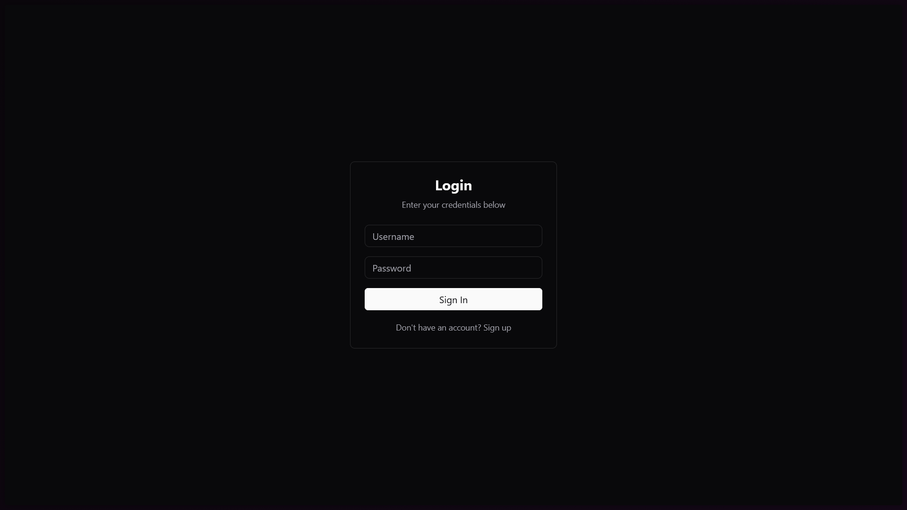
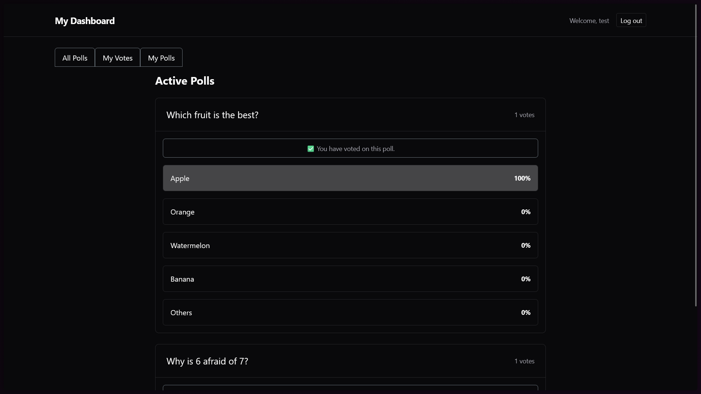
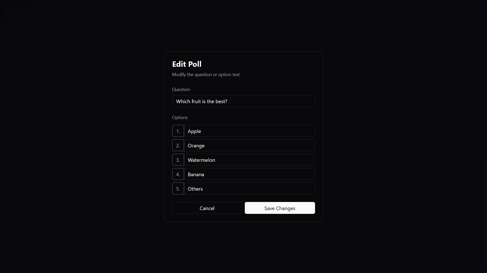
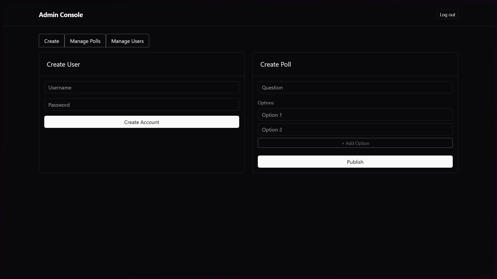

# Simple Polling API

A web-based polling application built with Spring Boot that allows users to create, vote on, and manage polls with an intuitive dashboard interface.

## ✨ Features

- 🗳️ **Create & Manage Polls** - Users can create their own polls with custom options
- 📊 **Real-time Voting** - Vote on polls and see instant results with percentage bars
- 📱 **User Dashboard** - Three-tab interface: All Polls, My Votes, and My Polls
- 🎨 **Visual Feedback** - Grey highlight on option selection with smooth animations
- 🔐 **Secure Authentication** - User registration and login with role-based access
- 👥 **Admin Panel** - Administrators can manage all polls and users
- ✏️ **Edit & Delete** - Poll creators can edit or remove their polls

## 📸 Showcase

### Login Page
Clean and simple authentication interface with registration support.



### Polls Dashboard
Browse and vote on polls with real-time results and visual feedback.



### Poll Editing
Edit your polls with an intuitive interface - modify questions and options easily.



### Admin Panel
Comprehensive admin dashboard for managing polls and users.



## 🚀 Quick Start

### Prerequisites
- Java 17+
- MySQL 8.0+
- Maven 3.6+

### Setup

1. **Create Database**
```sql
CREATE DATABASE polldb;
```

2. **Configure Database** - Edit `src/main/resources/application.properties`:
```properties
spring.datasource.url=jdbc:mysql://localhost:3306/polldb
spring.datasource.username=your_username
spring.datasource.password=your_password
```

3. **Run Application**
```bash
mvnw spring-boot:run
```

4. **Access** - Open http://localhost:8080 and register/login

## 📖 Usage

- **Create Poll**: Navigate to "My Polls" tab → Enter question and options → Click "Create Poll"
- **Vote**: Go to "All Polls" tab → Select an option → Click "Submit Vote"
- **View Results**: Check "My Votes" tab to see polls you've voted on
- **Manage**: Edit or delete your polls from the "My Polls" tab

## 🛠️ Tech Stack

- **Backend**: Spring Boot 3.3.5, Spring Security, Spring Data JPA
- **Frontend**: Thymeleaf, Bootstrap 5
- **Database**: MySQL 8.0
- **Build Tool**: Maven

## 📂 Project Structure

```
src/main/java/com/example/valid/
├── controllers/        # REST controllers
├── models/            # JPA entities
├── repositories/      # Data access layer
└── security/          # Authentication & authorization

src/main/resources/
├── templates/         # Thymeleaf HTML templates
└── application.properties
```

## 📚 Documentation

- [Quick Start Guide](QUICK_START_GUIDE.md) - Detailed usage instructions
- [Architecture](ARCHITECTURE.md) - System design and flow diagrams
- [Implementation Details](USER_POLL_FEATURE_SUMMARY.md) - Technical overview
- [Visual Feedback Feature](VISUAL_FEEDBACK_FEATURE.md) - UI enhancement details

## 🔒 Security

- Password encryption with BCrypt
- CSRF protection enabled
- Role-based access control (USER/ADMIN)
- Ownership validation for poll operations

## 📄 License

This project is created for educational purposes.
